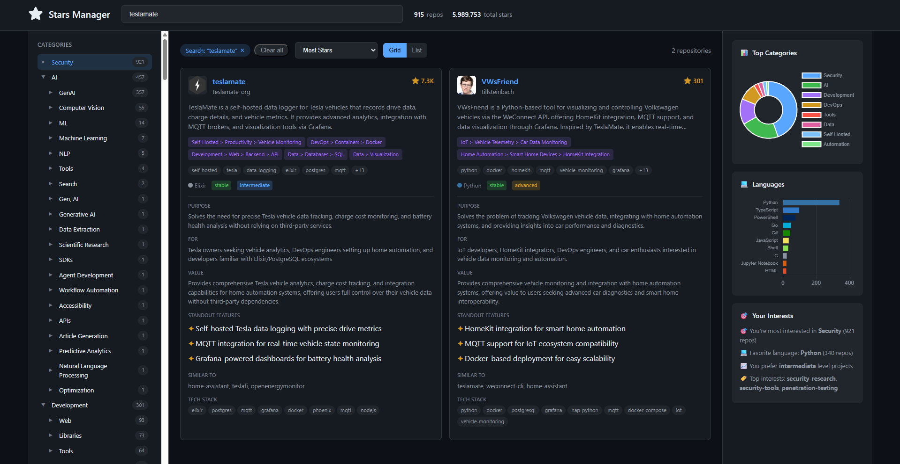

# GitHub Stars Manager

An intelligent dashboard for managing, analyzing, and discovering patterns in your GitHub starred repositories. Uses local LLM via Ollama to create rich metadata, hierarchical taxonomy, and smart tagging.


## Preview



*Interactive dashboard with hierarchical taxonomy, fuzzy search, tag filtering, and rich metadata display*

## Features

### Smart Analysis
- **LLM-Powered Understanding**: Uses any Ollama model locally to analyze each README
- **Hierarchical Taxonomy**: Multi-level depth trees for precise categorization
- **Rich Metadata**: Purpose, target audience, use cases, standout features
- **Quality Signals**: Maturity, complexity, documentation quality

### Interactive Dashboard
- **Category Tree Navigation**: Browse by hierarchical taxonomy
- **Fuzzy Search**: Search across all metadata with Fuse.js
- **Tag Cloud**: Filter by popular tags
- **Multiple Views**: Grid and list layouts
- **Expandable Cards**: Click to reveal detailed analysis

### Insights & Analytics
- **Interest Profiling**: Discover your starring patterns
- **Language Distribution**: See your tech preferences
- **Category Breakdown**: Visual charts of your interests

## Prerequisites

- Python 3.8+
- [GitHub CLI (gh)](https://cli.github.com/) installed and authenticated
- [Ollama](https://ollama.ai/) running locally with any LLM model

### Install Ollama & Model

```bash
# Install Ollama from https://ollama.ai/

# Pull a model (choose based on your hardware):
ollama pull llama3.1:8b      # Good balance, 8B params
ollama pull mistral:7b        # Fast and capable, 7B params
ollama pull qwen2.5:14b       # More capable, 14B params
ollama pull deepseek-r1:32b   # Best quality, requires more RAM

# Verify it's running:
ollama list
```

## Quick Start

### One-Command Pipeline (Recommended)

```bash
python run.py
```

This runs the complete pipeline:
1. ✅ Fetches your latest starred repos from GitHub
2. ✅ Downloads READMEs (only new ones, incremental)
3. ✅ Analyzes with LLM (only new repos, uses cache)
4. ✅ Generates the interactive dashboard

**Incremental Updates**: Run `python run.py` anytime to pick up newly starred repos. Only new repos are processed - everything else uses the cache!

### Manual Step-by-Step (Optional)

If you prefer to run steps individually:

#### 1. Fetch Starred Repos & READMEs

```bash
python fetch_readmes.py
```

- Automatically fetches your starred repos from GitHub API
- Creates/updates `starred.csv` with repo metadata
- Downloads README files (only new ones)
- Fully incremental - safe to run anytime

#### 2. Analyze with LLM

```bash
# Make sure Ollama is running:
ollama serve

# Configure model in analyze_readmes.py (edit MODEL variable)
# Then run analysis:
python analyze_readmes.py
```

This analyzes each README and creates `analyzed_repos.json`.

**Note**: First run takes time (varies by model). Results are cached - subsequent runs only analyze new/changed READMEs.

#### 3. Generate Dashboard

```bash
python generate_dashboard.py
```

Open `dashboard.html` in your browser!

## Project Structure

```
gh-stars-manager/
├── run.py                   # 🚀 Main pipeline runner (run this!)
├── fetch_readmes.py         # Fetches starred repos & READMEs (incremental)
├── analyze_readmes.py       # LLM analysis (incremental, cached)
├── generate_dashboard.py    # Creates HTML dashboard
├── test_ollama.py           # Test Ollama connection
├── starred.csv              # Cached repo metadata (auto-generated)
├── analyzed_repos.json      # Analysis results (auto-generated)
├── analysis_cache.json      # LLM analysis cache (auto-generated)
├── dashboard.html           # Interactive dashboard (auto-generated)
├── README.md                # This file
└── readmes/                 # Downloaded README files (auto-generated)
    ├── owner1_repo1.md
    ├── owner2_repo2.md
    └── _failed_repos.txt
```

## Taxonomy System

The analyzer creates hierarchical categories using depth trees (2-4 levels deep). The LLM automatically assigns repos to appropriate categories based on their README content.

**Example taxonomy structure:**
```
Category > Subcategory > Specific > Detail

Examples:
- "Development > Web > Frontend > React"
- "Data > Processing > ETL"
- "DevOps > Containers > Kubernetes"
- "Documentation > Knowledge Base"
```

Categories emerge naturally from your starred repos - the LLM identifies patterns and creates a taxonomy that fits your collection.

## Configuration

Edit the scripts to customize:

### `analyze_readmes.py`
| Variable | Default | Description |
|----------|---------|-------------|
| `MODEL` | Set to your model | Ollama model to use (e.g., `qwen3:8b`, `llama3.1:8b`) |
| `OLLAMA_URL` | `localhost:11434` | Ollama API endpoint |
| `MAX_README_LENGTH` | `12000` | Truncate long READMEs |

### `fetch_readmes.py`
| Variable | Default | Description |
|----------|---------|-------------|
| `MAX_WORKERS` | `5` | Concurrent downloads |
| `RETRY_ATTEMPTS` | `2` | Retry failed fetches |

## Dashboard Features

### Keyboard Shortcuts
- `/` - Focus search
- `Esc` - Clear filters / unfocus search

### Filtering
- Click taxonomy tree items to filter by category
- Click tags to add tag filters
- Use search for fuzzy matching across all fields
- Combine multiple filters

### Sorting
- Stars (high/low)
- Name (A-Z / Z-A)
- Complexity (easy/hard first)

### Card Details
Click any repo card to expand and see:
- Purpose and target audience
- Potential value
- Standout features
- Similar projects
- Full tech stack

## Data Model

Each analyzed repo contains:

```json
{
    "repo": "owner/name",
    "name": "name",
    "owner": "owner",
    "github_url": "https://github.com/owner/name",
    "stars": 1234,
    "language": "Python",

    "summary": "Brief description of the project",
    "purpose": "What problem it solves",
    "target_audience": "Who it's for",

    "taxonomy": [
        "Category > Subcategory > Specific",
        "AlternativeCategory > Path"
    ],

    "tags": ["tag1", "tag2", "tech", "domain"],
    "tech_stack": ["Language", "Framework", "Platform"],
    "use_cases": ["use case 1", "use case 2"],

    "maturity": "stable",
    "complexity": "intermediate",
    "documentation_quality": "good",
    "activity_status": "active",

    "similar_to": ["similar-project-1", "similar-project-2"],
    "keywords": ["keyword", "search", "terms"],
    "standout_features": ["feature 1", "capability 2"],
    "potential_value": "Why this repo is valuable"
}
```

## Troubleshooting

### Ollama connection error
```bash
# Make sure Ollama is running
ollama serve

# Check if model is available
ollama list

# Pull your chosen model if needed
ollama pull <model-name>
```

### Slow analysis
- Analysis speed depends on your hardware
- First run analyzes all repos; subsequent runs use cache
- To re-analyze everything: delete `analysis_cache.json`

### Missing READMEs
- Some repos don't have READMEs
- Failed repos are logged in `readmes/_failed_repos.txt`
- These repos get minimal metadata from CSV

## Incremental Workflow

The system is designed for frequent updates:

- **First Run**: Processes all ~900 starred repos (takes time)
- **Subsequent Runs**: Only processes new stars (fast! ⚡)
- **Smart Caching**: Everything uses caching at every level:
  - `starred.csv` - GitHub API cache
  - `readmes/` - Downloaded README cache
  - `analysis_cache.json` - LLM analysis cache

**Example workflow:**
```bash
# Today: Analyze all 900 repos (takes hours)
python run.py

# Tomorrow: Star 5 new repos
# Run again - only processes those 5 new repos! (takes minutes)
python run.py

# Next week: Star 10 more repos
# Run again - only processes those 10 (fast!)
python run.py
```

## Tips

1. **Daily/Weekly Updates**: Run `python run.py` regularly to stay up to date
2. **Force Re-analysis**: Delete `analysis_cache.json` to re-analyze all repos
3. **Fresh Start**: Delete `starred.csv`, `readmes/`, and `analysis_cache.json` to start from scratch
4. **Model Selection**: Choose faster models (7-8B params) for speed or larger models (30B+) for better analysis quality
5. **Offline Dashboard**: The HTML dashboard is fully self-contained and works without internet
6. **Test Ollama**: Run `python test_ollama.py` if you have connection issues

## Model Recommendations

| Model Size | Speed | Quality | RAM Required | Best For |
|------------|-------|---------|--------------|----------|
| 7-8B | Fast | Good | 8GB+ | Quick analysis, many repos |
| 14B | Medium | Better | 16GB+ | Balanced performance |
| 32B+ | Slow | Best | 32GB+ | Maximum accuracy |

## License

MIT

---

Built for developers who star repos and want to rediscover them.
